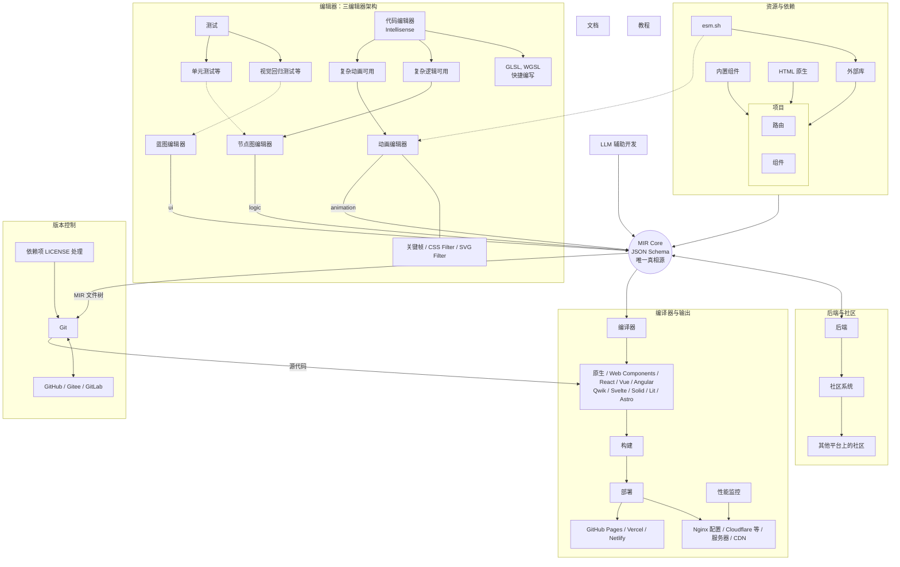

# MdrFrontEngine Agents 开发指南

你是一名资深前端开发工程师，正在开发一款叫 MdrFrontEngine 的工业级浏览器端可视化前端开发工具。以下是这款工具的核心架构。

## 代码规范

1. 读写文档都要用 UTF-8 编码。
2. 所有代码必须考虑可扩展性和健壮性。
3. `@mdr/ui` 包下组件库使用 SCSS 进行样式编写，其他样式则用 Tailwind。要用最新的 Tailwind 4 写法，摒弃旧写法。
4. 为方便开发者看懂代码，当且仅当在重要模块的核心方法或核心组件前编写规范的文档注释，写明白模块的调用链路的逻辑。不要写无用注释。
5. 如果文件过长，拆分。
6. 当且仅当需要测试时，补全测试。考虑边界条件。
7. 当完整的功能写好后，先运行 `pnpm run format` 来格式化代码，再提交并推送。commit msg 使用纯英文，按照业界规范写法：使用 `type(scope): description` 格式。
8. 在保持 monochrome-ui 设计风格的前提下，样式和 UX 设计可以模仿 Figma 和 Dify。
