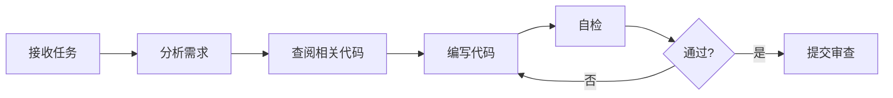

```markdown
# MdrFrontEngine Agents 开发指南

## 概述

本文档定义了 MdrFrontEngine 项目中各个 AI Agent 的职责、工作流程和协作方式。每个 Agent 负责特定的开发任务，通过明确的接口协同工作。

---

## Agent 架构图

```

┌─────────────────────────────────────────────────────────────────┐
│                        项目协调层                                 │
│                   (Project Coordinator)                          │
└──────────────┬──────────────────────────────────────────────────┘
               │
       ┌───────┴───────┐
       │               │
   ┌───▼────┐     ┌───▼────┐
   │ 架构   │     │ 任务   │
   │ Agent  │◄───►│ Agent  │
   └───┬────┘     └───┬────┘
       │              │
   ┌───▼──────────────▼───┐
   │                      │
┌──▼───┐  ┌────┐  ┌────┐  ┌──▼───┐
│ UI   │  │ MIR│  │Node│  │ Test │
│Agent │  │Gen │  │Graph│  │Agent │
└──────┘  └────┘  └────┘  └──────┘

```

---

## 1. Project Coordinator (项目协调者)

### 职责
- 全局项目规划与进度跟踪
- 任务分解与分配
- Agent 间协调与冲突解决
- 代码审查与质量把控

### 工作流程

```yaml
输入:
  - 用户需求 (自然语言)
  - 现有代码库状态
  - 技术栈限制

处理:
  1. 需求分析与拆解
  2. 生成任务列表 (tasks.json)
  3. 分配任务给专项 Agent
  4. 监控任务进度
  5. 集成各 Agent 产出

输出:
  - 任务分配清单
  - 里程碑时间表
  - 技术决策文档
```

### 示例对话

```
User: "我想实现拖拽组件到画布的功能"

Coordinator:
1. [分析] 这需要涉及：
   - UI 层 (拖拽交互)
   - 状态管理 (组件树更新)
   - MIR 生成 (保存到 MIR 结构)
   
2. [任务分解]
   - Task#001: UI Agent 实现 DragDropCanvas 组件
   - Task#002: MIR Agent 设计组件树数据结构
   - Task#003: Test Agent 编写 E2E 测试

3. [分配]
   @UI-Agent: 请使用 @dnd-kit 实现拖拽画布
   @MIR-Agent: 设计 ComponentNode 的增删改查接口
   @Test-Agent: 编写拖拽功能的 Playwright 测试
```

---

## 2. Architecture Agent (架构 Agent)

### 职责

- 系统架构设计与演进
- 技术选型与评估
- 性能优化建议
- 代码结构规范

### 关键能力

```typescript
interface ArchitectureAgent {
  // 评估技术栈
  evaluateTech(requirement: string): TechStack;
  
  // 设计模块接口
  designInterface(module: string): APIDefinition;
  
  // 优化建议
  suggestOptimization(codebase: string): Recommendation[];
  
  // 依赖分析
  analyzeDependencies(pkg: PackageJson): DependencyReport;
}
```

### 输出物示例

```markdown
# 拖拽系统架构设计

## 技术选型
- **库**: @dnd-kit/core (理由: 轻量、类型安全)
- **状态管理**: Zustand (理由: 已使用，避免引入新依赖)

## 模块结构
apps/web/src/editor/features/design/
├── DragDropCanvas.tsx       # 主画布
├── ComponentPalette.tsx     # 组件库
├── hooks/
│   ├── useDragDrop.ts       # 拖拽逻辑
│   └── useComponentTree.ts  # 组件树操作
└── types.ts                 # 类型定义

## 数据流
[Palette] --(drag)--> [Canvas] --(drop)--> [Store] --(update)--> [MIR]
```

---

## 3. Task Agent (任务执行 Agent)

### 职责

- 接收并执行具体编码任务
- 生成符合规范的代码
- 编写单元测试
- 提交代码审查

### 工作流程



### 代码规范检查清单

```yaml
- [ ] TypeScript 类型完整
- [ ] 遵循命名约定 (大驼峰 CSS 类名)
- [ ] 无 ESLint 错误
- [ ] 有 JSDoc 注释
- [ ] 单元测试覆盖率 > 80%
- [ ] 无硬编码魔法值
- [ ] 避免使用 localStorage (artifacts 限制)
```

---

## 4. UI Agent (界面开发 Agent)

### 职责

- React 组件开发
- @mdr/ui 组件库使用
- 样式实现 (SCSS)
- 响应式布局

### 开发模板

```typescript
// apps/web/src/editor/features/design/ComponentPalette.tsx

import { MdrPanel, MdrDiv } from '@mdr/ui';
import { COMPONENT_REGISTRY } from '@/core/components/registry';
import { useDraggable } from '@dnd-kit/core';

interface ComponentPaletteProps {
  // 接口定义
}

/**
 * 组件库面板 - 显示可拖拽的组件列表
 * @component
 */
export function ComponentPalette({ }: ComponentPaletteProps) {
  return (
    <MdrPanel title="组件库" collapsible>
      <MdrDiv display="Grid" gap="12px">
        {Object.entries(COMPONENT_REGISTRY).map(([type, Component]) => (
          <DraggableComponent key={type} type={type} />
        ))}
      </MdrDiv>
    </MdrPanel>
  );
}

// 样式文件: ComponentPalette.scss
.ComponentPalette {
  &.Dragging {
    opacity: 0.5;
  }
}
```

### 必须遵循的规则

```yaml
CSS 类名:
  - 组件前缀: Mdr (例: MdrButton)
  - 大驼峰: .ComponentPalette
  - 嵌套类: .Small, .Primary (不是 .component-palette-small)

导入:
  - UI 组件: from '@mdr/ui'
  - 主题: from '@mdr/themes'
  - 类型: from '@mdr/shared'

状态管理:
  - 避免 localStorage/sessionStorage
  - 使用 React state 或 Zustand
```

### 设计理念

减少“边框”和“色块”的使用；布局尽量紧凑；尽量用图标按钮（带label）而不是文本按钮；通过“功能按需展现”的模式实现onhover等效果（例如：原本一个栏目只显示几个元素，当onhover的时候，显示出来隐藏的图标按钮，而不是把整个栏目的背景加深，边框加粗）

**借鉴 Figma。**

---

## 5. MIR Generator Agent (MIR 生成 Agent)

### 职责

- MIR 文档生成与解析
- AST ↔ MIR 转换
- 代码生成 (React/Vue/HTML)
- MIR Schema 校验

### 核心任务

```typescript
// apps/web/src/mir/generator/mirToReact.ts

export const generateReactCode = (mirDoc: MIRDocument): string => {
  // 1. 解析 MIR 文档
  const { ui, logic } = mirDoc;
  
  // 2. 生成组件代码
  const componentCode = generateComponent(ui.root);
  
  // 3. 生成状态管理
  const stateCode = generateState(logic?.state);
  
  // 4. 生成事件处理器
  const eventCode = generateEvents(ui.root.events);
  
  // 5. 组装完整代码
  return assembleCode({
    imports: generateImports(),
    component: componentCode,
    state: stateCode,
    events: eventCode,
  });
};
```

### MIR 更新流程

```yaml
用户操作:
  - 拖拽组件到画布
  
UI Agent:
  - 更新组件树视图
  
MIR Agent:
  1. 获取新组件配置
  2. 生成 ComponentNode
  3. 插入到 MIR 树
  4. 触发状态更新
  5. 实时预览
  
输出:
  - 更新后的 MIR JSON
  - 实时生成的代码
```

---

## 6. Node Graph Agent (节点图 Agent)

### 职责

- 节点图编辑器开发
- 自定义节点类型
- 数据流执行引擎
- 调试器集成

### 节点类型定义

```typescript
// apps/web/src/core/nodes/types.ts

export interface MdrNode {
  id: string;
  type: 'http' | 'transform' | 'condition' | 'loop';
  inputs: NodePort[];
  outputs: NodePort[];
  config: Record<string, any>;
  execute: (inputs: any) => Promise<any>;
}

// 示例：HTTP 请求节点
export class HttpRequestNode implements MdrNode {
  type = 'http';
  
  inputs = [
    { name: 'url', type: 'string' },
    { name: 'method', type: 'string' },
  ];
  
  outputs = [
    { name: 'data', type: 'object' },
    { name: 'error', type: 'Error' },
  ];
  
  async execute(inputs: { url: string; method: string }) {
    try {
      const response = await fetch(inputs.url, { method: inputs.method });
      return { data: await response.json() };
    } catch (error) {
      return { error };
    }
  }
}
```

---

## 7. Test Agent (测试 Agent)

### 职责

- 编写单元测试 (Vitest)
- 编写 E2E 测试 (Playwright)
- 测试覆盖率分析
- 性能测试

### 测试模板

```typescript
// apps/web/src/editor/features/design/__tests__/DragDrop.test.tsx

import { describe, it, expect } from 'vitest';
import { render, fireEvent } from '@testing-library/react';
import { DragDropCanvas } from '../DragDropCanvas';

describe('DragDropCanvas', () => {
  it('应该能拖拽组件到画布', () => {
    const { getByTestId } = render(<DragDropCanvas />);
    
    const button = getByTestId('palette-button');
    const canvas = getByTestId('design-canvas');
    
    // 模拟拖拽
    fireEvent.dragStart(button);
    fireEvent.drop(canvas);
    
    // 验证组件已添加到画布
    expect(canvas.children.length).toBe(1);
  });
});
```

```typescript
// tests/e2e/specs/drag-drop.spec.ts

import { test, expect } from '@playwright/test';

test('拖拽组件到画布', async ({ page }) => {
  await page.goto('/editor');
  
  // 拖拽按钮组件
  await page.dragAndDrop(
    '[data-component="button"]',
    '[data-testid="canvas"]'
  );
  
  // 验证代码生成
  const code = await page.locator('[data-testid="code-preview"]').textContent();
  expect(code).toContain('<MdrButton');
});
```

---

## Agent 协作示例

### 场景：实现表单验证功能

```yaml
1. Coordinator 分析需求:
   - 需要 UI 层的表单组件
   - 需要 MIR 层的验证规则定义
   - 需要节点图的验证逻辑

2. Architecture Agent 设计:
   架构/web/src/
   ├── components/Form/        # UI 层
   ├── mir/validator/          # MIR 校验
   └── core/nodes/validate/    # 验证节点

3. Task 分配:
   - UI Agent → 开发 FormInput 组件
   - MIR Agent → 扩展 MIR Schema 支持验证规则
   - Node Graph Agent → 实现验证节点
   - Test Agent → 编写测试用例

4. 并行开发:
   [UI Agent]
   export function FormInput({ validation }: Props) {
     const [error, setError] = useState('');
     // ...
   }
   
   [MIR Agent]
   interface ComponentNode {
     validation?: {
       rules: ValidationRule[];
       messages: Record<string, string>;
     }
   }
   
   [Node Graph Agent]
   class ValidateNode implements MdrNode {
     execute(input: any) {
       // 执行验证逻辑
     }
   }

5. 集成测试:
   Test Agent 编写端到端测试验证整体功能
```

---

## 沟通协议

### 任务提交格式

```markdown
## Task #XXX: [任务名称]

**负责人**: @Agent-Name
**依赖**: Task#YYY, Task#ZZZ
**优先级**: High | Medium | Low
**预计工时**: X 小时

### 需求描述
[详细描述]

### 技术要求
- 使用 XXX 库
- 遵循 YYY 规范

### 验收标准
- [ ] 功能正常
- [ ] 测试通过
- [ ] 文档完善

### 交付物
- [ ] 代码文件
- [ ] 单元测试
- [ ] 使用文档
```

### 代码审查清单

```yaml
架构层面:
  - [ ] 符合模块化设计
  - [ ] 无循环依赖
  - [ ] 接口设计合理

代码质量:
  - [ ] TypeScript 无 any
  - [ ] 无 console.log
  - [ ] 遵循 ESLint 规则
  - [ ] 命名语义化

性能:
  - [ ] 无不必要的重渲染
  - [ ] 使用 useMemo/useCallback
  - [ ] 避免大对象深拷贝

测试:
  - [ ] 单元测试覆盖 > 80%
  - [ ] 关键路径有 E2E 测试
```

---

## 紧急情况处理

### Agent 遇到阻塞

```yaml
情况: UI Agent 等待 MIR Agent 定义接口

解决流程:
  1. UI Agent 报告阻塞: @Coordinator 我需要 ValidationRule 类型定义
  2. Coordinator 检查任务依赖
  3. 调整优先级或分配临时接口
  4. 继续并行开发
```

### 技术选型冲突

```yaml
情况: Architecture Agent 建议用 Rete.js, Node Graph Agent 更熟悉 ReactFlow

决策流程:
  1. 双方提供技术对比报告
  2. Coordinator 组织技术评审
  3. 基于项目目标做出决定
  4. 记录决策理由 (ADR 文档)
```

---

## 最佳实践

### 1. 保持原子性

每个 Agent 的任务应该是独立、可测试的单元

### 2. 文档先行

在编码前先编写接口文档和类型定义

### 3. 增量交付

优先完成 MVP 功能，再迭代优化

### 4. 频繁集成

每完成一个小功能就提交，避免大批量合并冲突

### 5. 自动化优先

- 使用 GitHub Actions 自动运行测试
- Pre-commit hook 检查代码规范

读取文件时请务必添加 `-Encoding utf8` 参数。例如使用 `Get-Content -Encoding utf8 AGENTS.md`。

---

## 附录

### Agent 技能矩阵

| Agent        | TypeScript | React | Node.js | Testing | 架构设计 |
| ------------ | ---------- | ----- | ------- | ------- | -------- |
| Coordinator  | ⭐⭐⭐        | ⭐⭐⭐   | ⭐⭐      | ⭐⭐⭐     | ⭐⭐⭐⭐⭐    |
| Architecture | ⭐⭐⭐⭐       | ⭐⭐⭐   | ⭐⭐⭐     | ⭐⭐      | ⭐⭐⭐⭐⭐    |
| UI Agent     | ⭐⭐⭐⭐⭐      | ⭐⭐⭐⭐⭐ | ⭐⭐      | ⭐⭐⭐     | ⭐⭐⭐      |
| MIR Agent    | ⭐⭐⭐⭐⭐      | ⭐⭐⭐   | ⭐⭐⭐⭐    | ⭐⭐⭐     | ⭐⭐⭐⭐     |
| Node Graph   | ⭐⭐⭐⭐       | ⭐⭐⭐⭐  | ⭐⭐⭐     | ⭐⭐⭐     | ⭐⭐⭐      |
| Test Agent   | ⭐⭐⭐        | ⭐⭐⭐   | ⭐⭐      | ⭐⭐⭐⭐⭐   | ⭐⭐       |

### 常用命令速查

```bash
# 运行特定 Agent 的任务
pnpm task:run --agent=ui --task=001

# 查看任务状态
pnpm task:status

# 生成任务报告
pnpm task:report --week=1

# 运行集成测试
pnpm test:integration
```

---

**维护者**: MdrFrontEngine Core Team  
**最后更新**: 2025-01-22  
**版本**: v1.0

```
