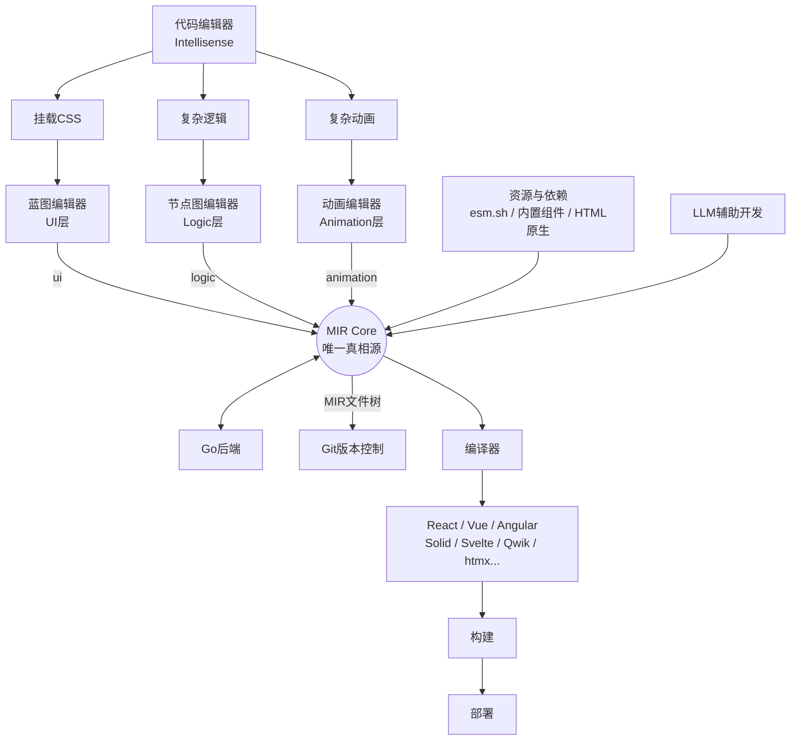

# CLAUDE.md

This file provides guidance to Claude Code (claude.ai/code) when working with code in this repository.

## Project Overview

MdrFrontEngine (MFE) is an open-source visual front-end development platform. Its core innovation is **MIR (Mdr Intermediate Representation)** — the single source of truth. Three editors (Blueprint, Node Graph, Animation) all converge into MIR, which compiles to production code for React, Vue, Angular, SolidJS, Svelte, Qwik, and more via Mitosis.



## Commands

### Development

```bash
pnpm dev              # Start all apps (Web + Backend + Docs)
pnpm dev:web          # Web editor only (port 5173)
pnpm dev:backend      # Go backend with hot reload (Air)
pnpm dev:docs         # VitePress docs site
pnpm dev:cli          # CLI tool
pnpm dev:vscode       # VSCode extension
```

### Build & Quality

```bash
pnpm build            # Build all
pnpm build:web        # Build web editor only
pnpm test             # Run all tests
pnpm test:web         # Run web tests only
pnpm test:web:watch   # Watch mode
pnpm test:web:coverage # Coverage (v8, thresholds: 80% stmts/lines for design features)
pnpm lint             # Lint all
pnpm format           # Format all (Prettier + Go fmt)
pnpm storybook:ui     # Component library Storybook
```

### Running a single test

```bash
pnpm --filter @mdr/web vitest run --config vitest.config.ts <test-file-pattern>
```

### Tailwind migration

```bash
pnpm tw:migrate       # Run Tailwind CSS upgrade tool
```

## Architecture

### Monorepo Structure (pnpm + Turborepo)

- **apps/web** — Core visual editor (React 19 + Vite + TypeScript). This is the primary product.
- **apps/backend** — Go (Gin + PostgreSQL) HTTP server. Auth, project, workspace modules.
- **apps/cli** — Commander-based CLI tool.
- **apps/docs** — VitePress documentation site.
- **apps/vscode** — VSCode extension for MIR language support + debugger.
- **packages/shared** — MIR schema types + Ajv validation. `@mdr/shared` is consumed by web via path alias.
- **packages/ui** — Shared SCSS component library + Storybook.
- **packages/themes** — Theme SCSS variables.
- **packages/i18n** — i18next resources.
- **packages/mir-compiler** — MIR compiler core package.
- **packages/eslint-plugin-mdr** — Custom ESLint plugin.
- **packages/vscode-debugger** — VSCode debug adapter.

### MIR Pipeline (apps/web/src/mir/)

All editor operations converge into MIR. The pipeline:

1. **schema/** — MIR TypeScript type definitions
2. **converter/** — AST-to-MIR conversion
3. **validator/** — MIR schema validation (Ajv)
4. **renderer/** — MIRRenderer renders MIR to live React components (component registry, icon registry, capabilities)
5. **generator/** — MIR-to-code generation (mirToCode.ts, mirToReact.ts, react/ subdirectory)
6. **resolveMirDocument.ts** — MIR document resolution before rendering

### Three-Editor Architecture (apps/web/src/editor/features/)

Each editor writes to MIR and reads from MIR:

- **design/** — Blueprint Editor: visual UI construction, drag-drop, palette, tree view, canvas, inspector, sidebar, viewport bar, autosave, external library runtime
- **development/** — Node Graph Editor: ReactFlow-based node graph (reactflow/ subdirectory)
- **animation/** — Animation Editor: timeline, keyframes, transitions, CSS/SVG filters

### State Management (apps/web/src/editor/store/)

Zustand stores, split into focused modules:

- **useEditorStore** — Core editor state (project, mirDoc, workspace snapshot, tree, route intent). Split into: `editorStore.tree.ts` (tree operations), `editorStore.normalizers.ts` (MIR normalizers), `editorStore.routeIntent.ts` (route-based intent), `editorStore.types.ts` (type definitions)
- **useSettingsStore** — Workspace/editor settings with hydration from backend
- Other stores: `useAuthStore` (auth), `breakpointStore` (debug), `nodeGraphRenderStore`, `metaStore` (external lib runtime), `i18nStore`

### Core Execution Engine (apps/web/src/core/)

- **executor/** — Graph execution engine
- **nodes/** — Built-in node definitions for node graph
- **worker/** — Web worker for execution

### Routing (apps/web/src/App.tsx)

React Router 7 with lazy-loaded editor sub-routes under `/editor`:

- `/editor` — EditorHome (dashboard)
- `/editor/project/:projectId` — ProjectHome
- `/editor/project/:projectId/blueprint` — BlueprintEditor
- `/editor/project/:projectId/nodegraph` — NodeGraphEditor
- `/editor/project/:projectId/animation` — AnimationEditor

Global shortcuts Alt+1–Alt+9 navigate between project sub-routes.

### Path Aliases (vite.config.ts + vitest.config.ts)

Both Vite and Vitest use the same aliases:

- `@/` → `apps/web/src/`
- `@mdr/shared` → `packages/shared/src/`
- `@mdr/ui` → `packages/ui/src/`
- `@mdr/themes` → `packages/themes/`

Vite uses `rolldown-vite@7.1.14` (Rust-based bundler) as an override.

## Coding Conventions

1. Use `@/...` imports within `apps/web`, not relative paths.
2. CSS class naming: PascalCase with `Mdr` prefix for components (e.g. `.MdrButton`, `.MdrSmall`). Nested classes use full words.
3. `@mdr/ui` components use SCSS; everything else uses **Tailwind CSS 4** syntax. Use `text-(--color-0)` not `text-[var(--color-0)]`.
4. Keep monochrome UI design style. UX can reference Figma and Dify.
5. Document comments only on core methods/components of important modules — explain the call chain logic, not what the code does.
6. Split files that get too long.
7. Format code with `pnpm format` before committing.
8. Commit messages: English, `type(scope): description` format.
9. Only commit/push when explicitly asked.
10. Design specs and architecture decisions are in `specs/decisions/`. MIR JSON Schema contracts in `specs/mir/`.

## Key Technical Notes

- Vite overrides: `rolldown-vite@7.1.14` via package.json `overrides` field
- Node polyfills: `vite-plugin-node-polyfills` for browser environment (Buffer, process, global)
- Vitest environment: jsdom, setup file at `src/test-utils/setup.ts`
- Mitosis (`@builder.io/mitosis`) handles multi-framework code output from MIR
- External libraries loaded via esm.sh bridge (`apps/web/src/esm-bridge/`)
- i18next with browser language detection (`apps/web/src/i18n/`)
