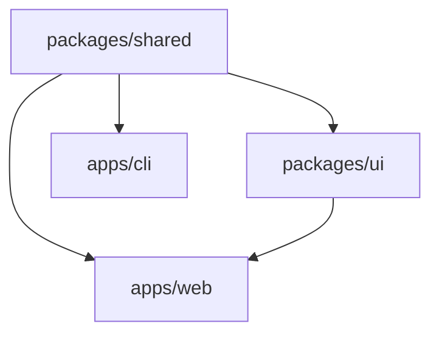

# MdrFrontEngine 完整功能文档

开源可视化前端开发平台 - 从设计到部署的全流程解决方案  
MIT License | 支持本地运行 + 云端协作

口号：**结合蓝图、节点图和代码；打通设计、开发、测试、构建和部署；跨领域开发前端、快速开发 MVP和学习前端的优质选择。**

---

## 📋 目录

1. [快速开始](#快速开始)
2. [整体架构](#整体架构)
3. [项目结构](#项目结构)
4. [核心功能详解](#核心功能详解)
5. [跨阶段通用能力](#跨阶段通用能力)
6. [用户角色功能映射](#用户角色功能映射)
7. [技术栈与集成](#技术栈与集成)
8. [MVP 路线图](#路线图)

---

## 快速开始

前置要求：Node >= 18.x（推荐 20.x 或以上的 LTS），PNPM >= 8.x，Go >= 1.24

```bash
git clone https://github.com/Mdr-Tutorials/mdr-front-engine
cd mdr-front-engine
pnpm install
pnpm run dev
```

## 整体架构

### 六大核心阶段

```txt
设计 → 开发 → 测试 → 构建 → 部署 → 社区
 ↓      ↓     ↓      ↓      ↓      ↓
视觉   逻辑   验证   生成   发布   协作
```

---

## 项目结构

MdrFrontEngine 采用 **Monorepo** 架构,使用 **pnpm workspace** + **Turborepo** 管理多包依赖与构建流程。

### 📁 目录结构总览

```txt
mdr-front-engine/
├── apps/                    # 应用层 - 可独立部署的应用
│   ├── backend/            # Go 后端服务
│   ├── cli/                # 命令行工具
│   ├── docs/               # 文档站点 (VitePress)
│   ├── vscode/             # VS Code 扩展
│   └── web/                # 主 Web 应用 (React)
│
├── packages/               # 共享包 - 可复用的库与工具
│   ├── eslint-plugin-mdr/  # ESLint 插件 (MIR 静态分析)
│   ├── mir-compiler/       # MIR 编译器核心
│   ├── shared/             # 共享类型与工具
│   ├── ui/                 # UI 组件库
│   └── vscode-debugger/    # VS Code 调试适配器
│
├── specs/                  # 规范文档
│   ├── mir/                # MIR 语言规范
│   └── rfc/                # RFC 提案模板
│
├── tests/                  # E2E 测试 (Playwright)
│   └── e2e/
│
├── .turbo/                 # Turborepo 缓存
├── node_modules/           # 依赖目录 (Hoisted)
│
├── package.json            # 根配置
├── pnpm-workspace.yaml     # Workspace 配置
├── turbo.json              # Turborepo 任务配置
└── tsconfig.base.json      # TypeScript 基础配置
```

---

### 🚀 应用层 (apps/)

#### `apps/web/` - 主前端应用

**技术栈**: React 19 + TypeScript + Vite + React Router 7

可视化编辑器的主要 Web 应用,提供完整的前端开发工作流。

```txt
apps/web/
├── src/
│   ├── core/              # 核心引擎
│   │   ├── executor/      # 节点图执行器
│   │   ├── nodes/         # 内置节点定义
│   │   ├── types/         # 类型定义
│   │   └── worker/        # Web Worker 隔离执行
│   │
│   ├── debug/             # 调试系统
│   │   ├── breakpoints/   # 断点管理
│   │   ├── stateMonitor/  # 状态监控
│   │   ├── timeline/      # 时间轴
│   │   └── variables/     # 变量查看器
│   │
│   ├── editor/            # 编辑器 UI
│   │   ├── blueprint/     # 蓝图编辑器 (可视化布局)
│   │   └── node/          # 节点图编辑器
│   │       ├── canvas/    # 画布渲染
│   │       ├── interaction/ # 交互逻辑
│   │       ├── layout/    # 自动布局算法
│   │       ├── ports/     # 端口渲染
│   │       └── states/    # 节点状态样式
│   │
│   ├── features/          # 功能模块
│   │   └── design/        # 设计阶段功能
│   │
│   ├── home/              # 首页
│   ├── mir/               # MIR 相关
│   │   ├── ast/           # 抽象语法树解析
│   │   ├── converter/     # AST ↔ MIR 转换
│   │   ├── generator/     # MIR → 代码生成
│   │   ├── schema/        # MIR 类型定义
│   │   └── validator/     # MIR 校验器
│   │
│   ├── themes/            # 主题系统
│   │   ├── base/          # 基础样式
│   │   ├── presets/       # 预设主题
│   │   ├── semantic/      # 语义化颜色
│   │   └── utils/         # 主题工具
│   │
│   ├── App.tsx            # 根组件
│   ├── main.tsx           # 应用入口
│   └── index.scss         # 全局样式
│
├── public/                # 静态资源
├── index.html             # HTML 模板
├── vite.config.ts         # Vite 配置
├── vitest.config.ts       # 单元测试配置
└── package.json
```

**核心功能**:

- 🎨 拖拽式组件设计
- 🔗 节点图逻辑编排
- 🐞 实时调试与状态追踪
- 🎭 MIR 代码生成与预览

---

#### `apps/backend/` - 后端服务

**技术栈**: Go 1.24, Gin v1.11

提供 API 服务、数据持久化、用户认证等后端能力。

```txt
apps/backend/
├── main.go           # 服务入口
├── go.mod            # Go 模块定义
└── Makefile          # 构建脚本
```

**职责**:

- 🔐 用户认证与授权
- 💾 项目数据存储
- 🌐 API 接口服务
- 🚀 部署集成

---

#### `apps/cli/` - 命令行工具

**技术栈**: Node.js + Commander

提供本地开发与自动化能力。

```txt
apps/cli/
├── src/
│   ├── cli.ts            # CLI 入口
│   ├── commands/         # 命令实现
│   │   ├── build.ts      # 构建命令
│   │   ├── deploy.ts     # 部署命令
│   │   └── export.ts     # 导出命令
│   └── utils/
│       └── logger.ts     # 日志工具
│
├── bin/
│   └── mdr.js            # 可执行脚本
└── package.json
```

**功能**:

```bash
mdr build      # 构建 MIR 项目
mdr export     # 导出静态站点
mdr deploy     # 一键部署
```

---

#### `apps/vscode/` - VS Code 扩展

**技术栈**: TypeScript + VS Code Extension API

为 `.mir.json` 文件提供编辑器支持。

```txt
apps/vscode/
├── src/
│   ├── extension.ts           # 扩展主入口
│   ├── index.ts               # 激活逻辑
│   ├── commands/              # 命令实现
│   │   └── previewMIR.ts      # 预览 MIR
│   ├── debugger/              # 调试适配器
│   │   └── debuggerAdapter.ts
│   └── language/              # 语言支持
│       ├── mir.language-configuration.json
│       └── mirDocumentSymbolProvider.ts
│
├── language/
│   └── mir.language-configuration.json  # 语言配置
├── package.json               # 扩展清单
└── esbuild.js                 # 构建脚本
```

**功能**:

- 📝 `.mir.json` 语法高亮
- 🔍 符号导航
- 🐞 断点调试
- 👁️ 实时预览

---

#### `apps/docs/` - 文档站点

**技术栈**: VitePress 1.6

项目文档与教程中心。

```txt
apps/docs/
├── .vitepress/
│   └── config.mts        # VitePress 配置
├── index.md              # 首页
├── reference/
│   └── reference.md      # 核心文档
└── package.json
```

**访问**: `http://localhost:5173/docs`

---

### 📦 共享包 (packages/)

#### `packages/ui/` - UI 组件库

**技术栈**: React + Sass + TypeScript

可复用的 UI 组件，遵循黑白设计语言。

```txt
packages/ui/
├── src/
│   ├── button/
│   │   ├── MdrButton.tsx
│   │   └── MdrButton.scss
│   ├── link/
│   │   ├── MdrLink.tsx
│   │   └── MdrLink.scss
│   ├── nav/
│   │   ├── MdrNav.tsx
│   │   └── MdrNav.scss
│   └── index.ts          # 统一导出
│
├── tsconfig.json
└── package.json
```

**特点**:

- 🎨 基于 10 级灰度设计系统
- 🌓 自动亮暗模式支持
- ♿ WCAG 2.1 AA 无障碍标准
- 📱 完全响应式

**使用示例**:

```tsx
import { MdrButton } from '@mdr/ui';

<MdrButton 
  text="提交" 
  size="Big" 
  category="Primary" 
/>
```

---

#### `packages/shared/` - 共享类型

**技术栈**: TypeScript

跨包共享的类型定义与工具函数。

```txt
packages/shared/
├── src/
│   ├── types/
│   │   └── MdrComponent.ts   # 组件基类接口
│   └── index.ts              # 导出
│
└── tsconfig.json
```

**导出内容**:

```typescript
export interface MdrComponent {
  className?: string;
  style?: React.CSSProperties;
  id?: string;
  dataAttributes?: Record<string, string>;
  onClick?: (e: React.MouseEvent) => void;
  as?: React.ElementType;
}
```

---

#### `packages/mir-compiler/` - MIR 编译器

**技术栈**: TypeScript

将 MIR 中间表示编译为目标框架代码。

```txt
packages/mir-compiler/
├── src/
│   ├── parser/           # MIR 解析器
│   ├── optimizer/        # 代码优化
│   ├── codegen/          # 代码生成
│   │   ├── react.ts      # React 生成器
│   │   ├── vue.ts        # Vue 生成器
│   │   └── html.ts       # 原生 HTML 生成器
│   └── index.ts
│
└── package.json
```

**支持目标**:

- ⚛️ React / Preact
- 💚 Vue 3
- 🅰️ Angular
- 🌐 原生 HTML/CSS/JS
- 🔷 SolidJS

---

#### `packages/eslint-plugin-mdr/` - ESLint 插件

**技术栈**: TypeScript + ESLint API

为 MIR 提供静态分析能力。

```txt
packages/eslint-plugin-mdr/
├── src/
│   ├── rules/
│   │   ├── no-circular.ts      # 检测循环依赖
│   │   ├── no-type-error.ts    # 类型错误检测
│   │   └── no-unused-var.ts    # 未使用变量
│   └── index.ts                # 插件入口
│
└── package.json
```

**集成方式**:

```json
{
  "plugins": ["@mdr/eslint"],
  "rules": {
    "@mdr/no-circular": "error"
  }
}
```

---

#### `packages/vscode-debugger/` - VS Code 调试适配器

**技术栈**: TypeScript + VS Code Debug Protocol

为 MIR 提供调试能力。

```txt
packages/vscode-debugger/
├── src/
│   ├── debugAdapter.ts       # DAP 实现
│   ├── runtime.ts            # 运行时模拟器
│   └── protocol.ts           # 协议定义
│
└── package.json
```

**功能**:

- ⏸️ 断点设置
- 🔍 变量查看
- 📊 调用栈追踪
- ⏭️ 单步执行

---

### 📋 规范文档 (specs/)

#### `specs/mir/` - MIR 语言规范

```txt
specs/mir/
├── MIR-v1.0.json             # JSON Schema 定义
└── decisions/
    └── 01.monochrome-ui.md   # 设计决策文档
```

**内容**:

- MIR 语法规范
- 类型系统定义
- 设计决策记录 (ADR)

---

#### `specs/rfc/` - RFC 提案

```txt
specs/rfc/
└── template.md               # RFC 提案模板
```

用于提出重大功能变更。

---

### 🧪 测试 (tests/)

#### `tests/e2e/` - 端到端测试

**技术栈**: Playwright

```txt
tests/e2e/
├── specs/                    # 测试用例
│   ├── debug-breakpoint.spec.ts
│   ├── node-diff.spec.ts
│   ├── node-state.spec.ts
│   └── performance.spec.ts
│
├── fixtures/                 # 测试数据
│   └── todo-app.mir.json
│
├── pages/                    # Page Object
│   └── EditorPage.ts
│
└── playwright.config.ts      # Playwright 配置
```

**运行**:

```bash
pnpm test:e2e
```

---

### 🔧 配置文件

#### 根目录配置

| 文件                  | 用途                          |
| --------------------- | ----------------------------- |
| `package.json`        | 根 package.json,定义全局脚本  |
| `pnpm-workspace.yaml` | pnpm workspace 配置           |
| `turbo.json`          | Turborepo 任务编排            |
| `tsconfig.base.json`  | 共享 TypeScript 配置          |
| `tsconfig.json`       | TypeScript Project References |
| `.prettierrc`         | Prettier 代码格式化           |
| `.eslintrc.cjs`       | ESLint 配置                   |
| `.gitignore`          | Git 忽略规则                  |

---

### 📦 依赖管理

#### Workspace 协议

```json
{
  "dependencies": {
    "@mdr/shared": "workspace:*",
    "@mdr/ui": "workspace:*"
  }
}
```

使用 `workspace:*` 协议引用 monorepo 内部包。

#### 公共依赖 Hoisting

所有包共享的依赖被提升到根 `node_modules/`,减少重复安装。

---

### 🚀 构建流程

#### Turborepo 任务拓扑



**执行顺序**:

1. 先构建 `packages/shared`
2. 并行构建 `packages/ui` 和 `apps/cli`
3. 最后构建 `apps/web`

**命令**:

```bash
# 构建所有包
pnpm build

# 只构建 web 应用及其依赖
pnpm build:web

# 开发模式 (并行启动所有 dev 任务)
pnpm dev
```

---

### 🎯 编写模块

#### 1. 新增功能模块

```bash
# 在 apps/web 中新增功能
apps/web/src/features/[feature-name]/
├── components/
├── hooks/
├── utils/
└── index.ts
```

#### 2. 新增共享包

```bash
# 创建新包
packages/[package-name]/
├── src/
├── tsconfig.json
└── package.json

# 在 pnpm-workspace.yaml 中无需手动添加
# 只要符合 packages/* 通配符即可
```

#### 3. 跨包引用

```typescript
// ✅ 正确 - 使用 workspace 协议
import { MdrButton } from '@mdr/ui';

// ❌ 错误 - 不要使用相对路径
import { MdrButton } from '../../../packages/ui';
```

#### 4. 类型安全

```typescript
// 所有包都继承自 tsconfig.base.json
{
  "extends": "../../tsconfig.base.json",
  "compilerOptions": {
    "composite": true,  // 启用 Project References
    "declaration": true // 生成 .d.ts
  }
}
```

---

### 📚 相关资源

- [Turborepo 官方文档](https://turbo.build/repo/docs)
- [pnpm Workspace](https://pnpm.io/workspaces)
- [TypeScript Project References](https://www.typescriptlang.org/docs/handbook/project-references.html)
- [Monorepo 最佳实践](https://monorepo.tools/)

---

**维护者**: Minsecrus  
**许可证**: MIT

---

## 核心功能详解

## 1️⃣ 设计阶段 (Design)

### 1.1 画布与布局

#### 基础操作

- 页面管理：新建/重命名/删除页面, 设置路由路径（如 `/home`, `/about`), 页面模板快速创建（空白/表单/落地页/仪表板）, 页面分组与文件夹管理, 页面复制与批量操作
- 拖拽系统：从组件库拖入组件到画布, 自由移动、等比缩放、旋转, 多选操作（框选/Shift点选）, 组合/解组（Cmd+G / Cmd+Shift+G）, 对齐与分布（左对齐/居中/等间距）, 智能吸附（组件边缘/中心/等距）, 布局约束（固定宽度/高度/比例）
- 辅助工具：参考线（水平/垂直拖拽生成）, 网格系统（8px/12列可配置）, 标尺与距离测量, 安全区域显示（移动端刘海/底部栏）, 出血线与裁切标记

#### 画布视图

- 缩放（10% ~ 400%）：自适应画布（Fit to Screen）, 聚焦选中组件（Cmd+2）
- 画布无限延展
- 小地图导航
- 演示模式（隐藏UI，全屏预览）
- 分屏对比（同时查看多个页面）

### 1.2 组件系统

#### 内置组件库

基础组件：文本（Text, Heading, Paragraph）, 按钮（Button, IconButton, ButtonGroup）, 输入（Input, Textarea, Search）, 容器（Div, Section, Card, Panel）, 图片（Image, Avatar, ImageGallery）, 链接（Link, Anchor）, 视频/音频播放器（Video, Audio）, 嵌入（Iframe, Embed）

智能表单：日期选择器（DatePicker, DateRangePicker, TimePicker）, 地域选择器（省市区三级联动）, 验证码输入, 密码强度显示, Regex 验证输入, 文件上传（File, ImageUpload）, 富文本编辑器（RichTextEditor）, 评分组件（Rating）, 颜色选择器（ColorPicker）, Slider/Range 输入

数据展示：表格（Table, DataGrid）, 列表（List, CheckList）, 树形控件（Tree, TreeSelect）, 标签（Tag, Badge）, 进度条（Progress, Spinner）, 统计数字（Statistic）, 时间轴（Timeline）, 步骤条（Steps）

媒体组件：轮播图（带缩略图/指示器）, 赞助商 Logo 轮播, 图片瀑布流, 视频背景（VideoBackground）, 3D模型查看器（ModelViewer - glTF/GLB）

可编程画布：Canvas 2D（手绘/签名）, WebGL（GLSL 着色器）, WebGPU（WGSL 计算着色器）, 图表组件（基于 Recharts/Chart.js）：折线图/柱状图/饼图/雷达图, 实时数据流图表, 地图组件（基于 Mapbox/Leaflet）

导航组件：导航栏（Navbar, Sidebar）, 面包屑（Breadcrumb）, 分页（Pagination）, 锚点导航（Anchor Navigation）, Tab 标签页（Tabs）, 折叠面板（Collapse, Accordion）

反馈组件：Modal 对话框, Drawer 抽屉, Tooltip 提示, Popover 气泡卡片, Message 全局提示, Notification 通知, Empty 空状态, Skeleton 骨架屏

#### 组件库扩展

- 第三方组件导入：Ant Design / Material UI 适配器, Element Plus / Chakra UI 适配器, Shadcn/ui 集成, Headless UI 支持, Radix UI 支持
  
- Figma 集成：导入 Figma 设计稿, 自动识别组件与样式, 双向同步（修改反向更新到 Figma）

- 自定义组件：React/Vue 组件开发, 注册为可拖拽组件, 组件商店上传与分享

### 1.3 样式系统

#### 视觉配置

- 布局：定位（Static/Relative/Absolute/Fixed/Sticky）, Display（Block/Flex/Grid/Inline）, Flexbox 可视化编辑（方向/对齐/换行）, Grid 可视化编辑（行列定义/间距）, Z-index 层级管理器

- 尺寸与间距：宽度/高度（px/em/rem/%/vw/vh）, Padding/Margin（统一/分边设置）, Min/Max 宽高, 纵横比锁定（Aspect Ratio）

- 颜色与背景：背景颜色（基于黑白设计语言 + 主题色梯度）, 渐变背景（线性/径向/锥形）, 背景图片（上传/URL）, 背景混合模式（Blend Mode）, 毛玻璃效果（Backdrop Filter）, 渐变网格背景（Mesh Gradient）

- 边框与阴影：边框（宽度/样式/颜色/圆角）, Box Shadow（多层阴影）, Text Shadow, 内阴影（Inset Shadow）, 苹果式曲率边框（Border Curvature）

- 文字：字体家族（系统字体/Google Fonts/自定义）, 字号/行高/字重, 文字颜色/对齐方式, 文字装饰（下划线/删除线）, 字间距（Letter Spacing）, 文字渐变（Gradient Text）, 文字描边（Text Stroke）

- 特效：透明度（Opacity）, 滤镜（模糊/饱和度/对比度等）, Transform（平移/旋转/缩放/倾斜）, 3D 变换（Perspective/Rotate3D）, 光线散射效果（Glow/Bloom）, 玻璃拟态（Glassmorphism）

#### 动效系统

- 预设动画：淡入/淡出（Fade In/Out）, 滑动（Slide Up/Down/Left/Right）, 缩放（Scale In/Out）, 旋转（Rotate In/Out）, 弹跳（Bounce）, 视差滚动（Parallax）, 滚动触发动画（Scroll-Driven Animations）

- 高级动画：关键帧编辑器（Timeline）, 缓动函数（Easing）可视化, 动画组合（Sequence/Stagger）, 手势驱动动画（Gesture Animation）, 物理引擎动画（Spring/Inertia）, Lottie 动画导入

#### 响应式设计

- 断点管理：预设断点（Mobile/Tablet/Desktop/XL）, 自定义断点（输入像素值）, 断点继承与覆盖, 容器查询（Container Queries）

- 响应式工具：画布切换设备尺寸, 显示/隐藏特定断点组件, 响应式字体（clamp 函数生成）, 响应式间距（Fluid Spacing）

#### 设计系统

- 主题管理：选择主题色（自动生成梯度）, 色彩模式切换（亮色/暗色）, 自定义色板（5/9/11 级梯度）, 语义化颜色（Primary/Success/Warning/Danger）

- 设计令牌：间距系统（4/8/12/16...px）, 字号系统（xs/sm/base/lg/xl...）, 阴影系统（sm/md/lg/xl）, 导出为 Design Tokens（JSON/YAML）, 从 Figma Tokens 导入

- 全局样式：CSS 变量管理, 全局 CSS 编辑器, Tailwind 配置可视化编辑, CSS 模块/Scoped CSS 支持

### 1.4 组件树与管理

- 层级视图：展开/折叠层级, 拖拽调整父子关系, 搜索组件（按名称/类型）, 按类型筛选（只显示按钮/输入等）

- 组件操作：重命名组件, 锁定/解锁（防误操作）, 显示/隐藏, 复制/粘贴/删除, 批量编辑（多选后统一修改属性）

- 组件状态：Normal/Hover/Active/Focus/Disabled, 为不同状态设置样式, 自定义伪类（:nth-child, :first-child 等）

### 1.5 AI 辅助设计

- 自然语言生成布局：输入描述（如"电商产品卡片，左图右文"）, LLM 生成组件结构与初始样式, 调整 AI 建议的布局

- 智能建议：配色建议（基于主题色）, 间距优化建议（符合8px网格）, 无障碍改进建议, 设计审查（Design Lint - 检测不一致）

- AI 对话助手："帮我生成一个登录表单", "把这个按钮改成圆角", "优化这个页面的加载性能", 设计意图识别（"让这个区域更突出"）

### 1.6 版本控制

- 历史记录：自动保存历史快照（每5分钟）, 手动创建版本节点, 版本命名与备注, Git 式分支管理（Branch/Merge）

- 版本对比：可视化对比两个版本差异, 回放操作序列（时间轴）, 选择性恢复（只恢复某个组件）, 冲突解决工具（协作时）

### 1.7 高级功能

- AR/VR 预览：导出为 WebXR 格式, 在手机/头显中测试交互, 空间 UI 设计工具

- 设计规范导出：生成设计文档（Markdown/PDF）, 组件使用指南, Storybook 导出

---

## 2️⃣ 开发阶段 (Development)

### 2.1 交互事件系统

#### 事件绑定

- 常见事件：onClick / onDoubleClick, onMouseEnter / onMouseLeave, onFocus / onBlur, onChange / onInput, onSubmit, onScroll / onResize, onKeyDown / onKeyUp（支持组合键）, onDrag / onDrop, onTouch（移动端触摸事件）

#### 触发器类型

1. 内置动作：跳转页面（指定路由/外部链接）, 显示/隐藏组件, 切换组件状态, 滚动到指定位置, 打开 Modal/Drawer, 触发表单验证, 下载文件, 复制到剪贴板, 分享（Web Share API）

2. JavaScript 代码：沙箱代码编辑器（Monaco Editor）, 语法高亮与自动补全, 访问组件状态与方法, TypeScript 支持, 代码片段（Snippets）库

3. 节点图逻辑：执行可视化逻辑流, 传递参数到节点图, 异步节点执行

### 2.2 节点图编辑器

#### 节点类型

输入/输出：事件节点（触发器）, 参数输入, 返回值输出, 全局事件监听（Window/Document 事件）

数据操作：变量读取/写入, 数据转换（JSON.parse/stringify）, 数组操作（map/filter/reduce）, 对象操作（merge/pick/omit）, 日期时间处理, 字符串处理（正则匹配/替换）, 数学运算（Math.*）

控制流：条件判断（If/Else）, 循环（For/While/ForEach）, 延迟（Delay/Timeout）, Switch 多分支, Try/Catch 错误处理, 并行执行（Promise.all）

API 交互：HTTP 请求（GET/POST/PUT/DELETE）, GraphQL 查询, WebSocket 连接, Server-Sent Events（SSE）, Fetch 取消（AbortController）

状态管理：更新组件状态, 更新全局状态, 触发页面重新渲染, 本地存储（LocalStorage/SessionStorage）, IndexedDB 操作

UI 操作：显示消息提示, 打开对话框, 播放动画, 聚焦元素, 滚动到视图

第三方集成：分析追踪（Google Analytics/Mixpanel）, 认证（Firebase Auth/Auth0）, 支付（Stripe/PayPal）, 邮件发送（SendGrid/Mailgun）, 文件存储（S3/Cloudinary）, 实时数据库（Firebase/Supabase）

高级节点：AI 调用（OpenAI API/Claude API）, 图像处理（裁剪/压缩/滤镜）, 文件读取（CSV/Excel/JSON 解析）, PDF 生成, 二维码生成/扫描, 语音识别（Web Speech API）, 地理位置（Geolocation API）

#### 节点图功能

- 编辑器：拖拽节点到画布, 连接节点（数据流/控制流）, 节点搜索与筛选, 节点注释与分组, 节点折叠（Subgraph）, 节点模板保存

- 调试：断点设置, 单步执行, 查看节点输出值, 执行路径高亮, 节点执行时间统计, 错误节点定位

- 优化：死节点检测（未连接的节点）, 循环依赖检测, 性能瓶颈提示, 节点图重构建议

### 2.3 状态管理

#### 数据类型

- 页面状态：局部状态（组件内）, 共享状态（兄弟组件间）, 状态持久化（刷新保留）

- 全局状态：用户信息（user）, 加载状态（loading）, 错误信息（error）, 全局配置（theme/locale）

- 表单状态：表单值（values）, 验证错误（errors）, 触摸状态（touched）, 脏检查（isDirty）

#### 状态绑定

- 双向绑定（v-model 式）
- 计算属性（Computed）
- 监听器（Watcher）
- 状态派生（Derived State）
- 状态中间件（Middleware）

#### 状态调试

- 状态树可视化
- 状态变更历史
- 时间旅行调试
- 状态快照导出/导入

### 2.4 数据源与 API

#### API 配置

- 可视化配置：URL 输入（支持变量插值）, Method 选择, Headers 编辑器（Key-Value）, Body 编辑器（JSON/FormData/Raw）, Query 参数可视化, 认证配置（Bearer Token/API Key/OAuth）

- 响应处理：成功回调（更新状态/显示消息）, 错误回调（错误提示/重试）, 数据转换（映射到状态结构）, 响应缓存策略, 乐观更新（Optimistic Update）

#### Mock 数据

- JSON 数据编辑器
- 随机数据生成（Faker.js）
- 延迟模拟
- Mock 场景切换（正常/错误/空数据）
- Mock Server 本地运行

#### GraphQL

- GraphQL Playground 集成
- 查询/变更可视化构建
- Schema 浏览器
- Fragment 管理
- 订阅（Subscription）支持

#### 数据库直连

- Firebase Firestore
- Supabase
- MongoDB Atlas
- Prisma 集成

### 2.5 自定义代码

#### 组件开发

- React 组件：JSX 编辑器, Hooks 支持（useState/useEffect 等）, Props 定义, TypeScript 类型定义, CSS-in-JS（Styled Components/Emotion）

- Vue 组件：SFC 编辑器（Template/Script/Style）, Composition API / Options API, Vue 3 Reactivity API

- Web Components：Custom Elements 定义, Shadow DOM 支持, Lit 框架支持

#### 代码注入

- Head 标签注入（Meta/SEO）
- Body 标签注入（Analytics）
- 全局 CSS/JS 注入
- 每页独立注入

### 2.6 多框架支持

- 框架切换：React, Vue, Angular, Svelte, Solid.js, Preact

- 框架特性：节点图输出对应框架代码, 框架专属节点（如 Vue Composables）, 跨框架组件桥接

### 2.7 PWA 与离线

- Service Worker：可视化配置缓存策略, 离线页面设置, 后台同步, 推送通知配置

- 离线逻辑：节点图中"缓存 API 响应", 离线数据队列, 冲突解决策略（Last Write Wins/CRDT）

- Progressive Enhancement：检测网络状态, 降级 UI, 自适应数据加载（低速网络优化）

### 2.8 插件系统

- 插件管理：浏览插件市场, 安装/卸载插件, 插件版本管理, 插件权限审查

- 插件开发：自定义节点开发, 自定义组件开发, 钩子系统（Hooks）, 插件 SDK 与脚手架, 插件沙箱隔离

- 官方插件：支付集成（Stripe/PayPal）, 认证集成（Auth0/Clerk）, CMS 集成（Contentful/Strapi）, 电商集成（Shopify/WooCommerce）, 邮件营销（Mailchimp/ConvertKit）

---

## 3️⃣ 测试阶段 (Testing)

### 3.1 预览系统

#### 实时预览

- 画布内预览：交互模式切换（编辑/预览）, 保持状态切换, 热重载（HMR）

- 独立预览窗口：新窗口打开, 设备模拟器（iPhone/iPad/Android）, 旋转模拟（横屏/竖屏）, 触摸模拟（点击变为触摸）, 网络限速模拟（3G/4G/5G）

- 分享预览：生成预览链接（临时/永久）, 密码保护, 二维码扫码预览, 预览链接过期设置

### 3.2 调试工具

#### 开发者工具

- 状态检查器：实时查看当前状态, 手动修改状态值, 状态变更历史, 状态搜索与筛选

- 节点图调试：节点执行路径可视化, 节点输出值查看, 断点与单步执行, 节点执行时间分析

- 网络监控：API 请求/响应日志, 请求时间分析, 错误请求高亮, 请求重放（Replay）, HAR 文件导出

- 控制台：console.log 输出, 错误堆栈追踪, 自定义日志分类

#### 性能分析

- 组件渲染时间
- 首次内容绘制（FCP）
- 最大内容绘制（LCP）
- 累积布局偏移（CLS）
- 火焰图分析
- 内存泄漏检测

### 3.3 响应式测试

- 设备切换：预设设备（iPhone/iPad/MacBook 等）, 自定义尺寸（输入宽高）, 批量测试（同时显示多尺寸）, 折叠屏模拟, 超宽屏测试（21:9/32:9）

- 断点测试：断点可视化标记, 断点间滑动预览, 断点覆盖率检查

### 3.4 无障碍测试

#### 自动检查

- axe-core 扫描：WCAG 2.1 AA/AAA 合规性, 自动修复建议, 问题严重级别分类, 实时扫描（编辑时提示）

- 常见问题：对比度不足, 缺少 Alt 文本, 缺少 ARIA 标签, 键盘导航断裂, 焦点顺序混乱, 表单无 Label

#### 手动测试

- 键盘导航：Tab 顺序可视化, Enter/Space 操作测试, Esc 关闭测试, 自定义快捷键冲突检测

- 屏幕阅读器：语义化 HTML 检查, ARIA 属性预览, 屏幕阅读器模拟器（VoiceOver/NVDA）

- 视觉模拟：色盲模式（红绿色盲/蓝黄色盲/全色盲）, 低视力模式（模糊/缩放）, 高对比度模式, 暗视觉模式（夜间视力）, 动画敏感模式（prefers-reduced-motion）

#### 无障碍报告

- 合规性评分
- 问题详细列表
- 修复优先级排序
- 导出 VPAT 报告
- 定期扫描与趋势分析

### 3.5 自动化测试

#### 测试录制

- 交互录制：记录用户操作（点击/输入/导航）, 自动生成测试断言, 智能等待（自动检测异步操作）

- 测试脚本生成：Cypress 脚本, Playwright 脚本, Jest 单元测试, Testing Library 脚本, Selenium WebDriver 脚本

#### 测试管理

- 测试用例库
- 测试套件组织
- 测试标签分类
- 参数化测试（Data-Driven）
- 测试优先级设置

#### 测试执行

- 本地运行测试
- 云端并行测试
- 测试覆盖率报告
- 视觉回归测试（截图对比）
- 跨浏览器测试（Chrome/Firefox/Safari）

#### CI/CD 集成

- 提交时自动测试
- PR 检查集成
- 测试失败通知
- 测试报告徽章（Badge）

### 3.6 A/B 测试

- 变体管理：创建多个页面变体, 设置流量分配比例, 变体命名与描述, 多变量测试（MVT）

- 对比预览：画布分屏对比, 快速切换变体, 差异高亮显示, 并排滚动同步

- 指标配置：转化目标设置（按钮点击/表单提交）, 追踪事件配置, 漏斗分析设置, 留存分析配置

- 结果分析：统计显著性计算, 置信区间显示, 胜者自动切换

### 3.7 SEO 与性能审计

#### SEO 检查

- 基础 SEO：Title/Description 检查, H1 标签检查, 图片 Alt 检查, 内链结构分析, Schema.org 结构化数据验证, Canonical 标签检查, Sitemap 生成, Robots.txt 配置

- 技术 SEO：页面加载速度, 移动友好度, HTTPS 检查, Core Web Vitals 分析, 爬虫可访问性检查

#### Lighthouse 审计

- 一键运行 Lighthouse
- 性能评分（0-100）
- 最佳实践评分
- SEO 评分
- PWA 评分
- 历史分数趋势

#### 优化建议

- 图片压缩建议
- 资源懒加载建议
- 代码分割建议
- 字体优化建议
- 第三方脚本延迟加载

---

## 4️⃣ 构建阶段 (Build)

### 4.1 代码生成

#### 导出格式

- 静态文件：HTML/CSS/JS（源代码）, HTML/CSS/JS（打包压缩）, 单页应用（SPA）, 多页应用（MPA）, AMP 页面, Email HTML（兼容邮件客户端）

- 框架项目：React 项目（Create React App/Vite）, Vue 项目（Vue CLI/Vite）, Angular 项目, Svelte 项目, Next.js 项目（带 App Router）, Nuxt 项目, Astro 项目, Remix 项目

- 组件库：React 组件库（Storybook 集成）, Vue 组件库, Web Components, NPM 包发布准备

- 原生应用：React Native（Expo）, Flutter Web, Capacitor（iOS/Android）, Electron（Desktop）

#### 代码配置

- 构建选项：启用/禁用 CDN, 内联资源（CSS/JS/Image）, 代码压缩（Minify）, 混淆（Obfuscate）, Source Map 生成, 代码分割策略（Route/Component/Vendor）

- 依赖管理：自动 tree-shaking, 依赖去重, 版本锁定, 依赖安全扫描（npm audit）, License 合规检查

- 代码风格：Prettier 格式化, ESLint 配置, 注释生成（JSDoc/TSDoc）, 命名规范选择（camelCase/kebab-case）

### 4.2 SSR/SSG

#### 服务端渲染

- Next.js 集成：getServerSideProps 生成, API Routes 生成, Middleware 配置, Server Components 支持, Streaming SSR

- Nuxt 集成：asyncData 生成, Server Middleware, Nitro Engine 配置

- 其他框架：Remix Loader/Action, Astro SSR, SvelteKit Load Functions

#### 静态站点生成

- 预渲染路径：指定需要预渲染的页面, 动态路由生成（如 /blog/[id]）, 增量静态再生（ISR）配置

- 数据获取：构建时 API 调用, CMS 数据拉取, 本地 Markdown/JSON 解析

### 4.3 容器化与部署准备

#### Docker 支持

- Dockerfile 生成：Node.js 基础镜像, 多阶段构建（Builder/Runner）, 环境变量注入, 健康检查配置, Docker Compose 生成

- 镜像优化：分层缓存优化, 最小化镜像大小, 安全扫描（Trivy/Snyk）

#### 服务器配置

- Nginx 配置：反向代理设置, HTTPS 重定向, Gzip 压缩, 缓存策略配置, 速率限制（Rate Limiting）

- Apache 配置：.htaccess 生成, 重写规则, 安全头配置（CSP/HSTS）

### 4.4 构建分析

#### 依赖报告

- 依赖列表（Name/Version/License）
- 依赖树可视化
- 重复依赖检测
- Bundle 大小分析（可视化饼图）
- 依赖更新检查（Outdated Packages）

#### 性能报告

- Bundle Size（总体/分块）
- 加载时间预估
- 首屏资源大小
- Tree-shaking 效果统计
- 未使用代码检测（Dead Code）

#### 可持续性报告

- 碳足迹估算（Bundle Size → CO2）
- 能效评级（A-F）
- 优化建议（减少 JS/使用轻量库）
- 绿色托管建议
- 可再生能源 CDN 推荐

### 4.5 代码审查

- 代码质量：复杂度分析（Cyclomatic Complexity）, 重复代码检测, 安全漏洞扫描（OWASP Top 10）, 最佳实践检查

- 可维护性：可读性评分, 文档覆盖率, 技术债务评估

---

## 5️⃣ 部署阶段 (Deployment)

### 5.1 部署目标

#### 静态托管

- Vercel：一键部署, 自动 HTTPS + CDN, 环境变量管理, Edge Functions 配置, Preview Deployments

- Netlify：拖拽部署, 表单处理, 函数部署, Split Testing 配置, Redirects/Rewrites 规则

- GitHub Pages：自动 GitHub Actions, 自定义域名, Jekyll 集成

- Cloudflare Pages：全球 CDN, Workers 集成, R2 存储集成

- AWS S3 + CloudFront：Bucket 配置, CDN 分发, Lambda@Edge 配置

#### 服务器部署

- VPS 部署：SSH 连接配置, PM2 进程管理, 自动化部署脚本（Shell/Ansible）

- 容器编排：Kubernetes 配置（Deployment/Service/Ingress）, Docker Swarm, Helm Chart 生成

- 平台即服务（PaaS）：Heroku, Railway, Render, Fly.io, DigitalOcean App Platform

### 5.2 CI/CD 管道

#### 配置生成

- GitHub Actions：Build + Test + Deploy 工作流, 多环境分支策略, Matrix 并行构建, 缓存优化

- GitLab CI：.gitlab-ci.yml 生成, Runner 配置, Auto DevOps 集成

- 其他 CI 工具：Jenkins Jenkinsfile, CircleCI config.yml, Travis CI .travis.yml, Bitbucket Pipelines

#### 部署策略

- 蓝绿部署（Blue-Green）
- 金丝雀发布（Canary）
- 滚动更新（Rolling Update）
- 特性开关（Feature Flags）集成
- 自动回滚策略

### 5.3 环境管理

#### 多环境配置

- 环境类型：Development（开发）, Staging（预发布）, Production（生产）, Testing（测试）, Preview（预览分支）

- 环境变量：可视化编辑器（Key-Value）, 密钥管理（加密存储）, 环境变量验证, .env 文件生成, 环境变量继承

- 配置管理：API 端点切换, 功能开关, 第三方密钥, 配置版本控制, 配置审计日志

### 5.4 版本管理

- 部署历史：部署时间轴, 版本标签, 部署日志, 部署对比（Diff）

- 回滚操作：一键回滚到任意版本, 回滚前确认, 回滚后验证, 自动回滚（健康检查失败）

- 发布管理：语义化版本（Semantic Versioning）, Changelog 自动生成, Release Notes, Tag 与分支关联

### 5.5 云函数集成

#### Serverless 函数

- Vercel Functions：API 路由生成, Edge Functions, Cron Jobs 配置

- Netlify Functions：后端逻辑部署, Background Functions, Event-Triggered Functions

- AWS Lambda：函数定义, API Gateway 集成, Lambda Layers 管理

- Cloudflare Workers：KV 存储, Durable Objects, Queues 集成

#### 节点图转函数

- 节点图自动转 Serverless 函数
- 冷启动优化
- 函数合并（减少冷启动）
- 边缘函数部署

### 5.6 监控与分析

#### 错误监控

- Sentry 集成：自动错误追踪, Source Map 上传, 用户反馈集成, Performance Monitoring, Session Replay

- 其他工具：Rollbar, Bugsnag, LogRocket（会话重放）

#### 用户分析

- Google Analytics：事件追踪配置, 转化目标, GA4 Measurement Protocol

- 隐私优先分析：Plausible, Umami, Fathom, Simple Analytics

- 热图与录屏：Hotjar, FullStory, Microsoft Clarity

#### 性能监控

- Real User Monitoring (RUM)：Core Web Vitals 追踪, 设备性能分布, 地域性能对比

- Uptime 监控：健康检查配置, 宕机告警, Status Page 生成

#### 仪表盘

- 实时流量
- 错误率趋势
- 性能指标
- 自定义仪表盘（拖拽配置）
- 告警规则配置

### 5.7 域名与 SSL

- 自定义域名：DNS 配置指引, CNAME/A 记录, 自动 DNS 验证

- SSL 证书：自动 HTTPS（Let's Encrypt）, 自定义证书上传, 证书续期提醒

- CDN 配置：全球加速, 缓存策略, 区域屏蔽, DDoS 防护

---

## 6️⃣ 社区阶段 (Community)

### 6.1 账户系统

#### 认证方式

- 邮箱 + 密码
- 手机号 + 验证码
- Google OAuth
- GitHub OAuth
- Apple Sign In
- Microsoft Account
- Magic Link（无密码登录）
- Web3 钱包（MetaMask）

#### 账户管理

- 个人资料编辑
- 头像上传
- 密码修改
- 双因素认证（2FA）
- 账户删除
- 数据导出（GDPR）

### 6.2 项目管理

#### 项目操作

- 创建与保存：保存到云端, 自动保存（每30秒）, 手动保存快照, 项目模板（空白/博客/电商等）

- 权限设置：公开/私有, 链接分享, 协作者邀请, 查看者/编辑者/管理员角色, 团队空间

- 组织结构：项目文件夹, 标签分类, 收藏项目, 归档项目, 项目搜索

#### 资产管理

- 独立组件：保存为可复用组件, 组件版本管理, 组件变体（Variants）

- 节点图模板：保存逻辑流为模板, 参数化模板, 节点图市场

- 设计系统：保存色板/字体系统, 跨项目复用, Design Tokens 同步

### 6.3 作品广场

#### 发现内容

- 浏览模式：最新作品, 热门作品（按点赞/浏览排序）, 精选作品（编辑推荐）, 趋势作品（上升最快）, 每日精选

- 搜索与筛选：关键词搜索, 标签筛选（#表单 #WebGL #无障碍）, 分类筛选（落地页/应用/游戏）, 高级筛选（框架/功能/难度）, 作者筛选

- 排序选项：时间（最新/最旧）, 热度（点赞数/浏览数）, 收藏数, 复杂度（简单到复杂）

#### 内容展示

- 作品缩略图
- 作品描述
- 作者信息
- 技术标签
- 实时预览（悬停显示）
- 功能亮点徽章

### 6.4 互动系统

#### 社交功能

- 点赞与收藏：一键点赞, 收藏到收藏夹, 收藏夹分类, 点赞历史

- 评论：作品评论, 回复评论, @提及用户, 评论排序（最新/热门）, 评论点赞, 评论举报

- 分享：生成分享链接, 社交媒体分享（Twitter/Facebook/LinkedIn）, Embed 代码（嵌入到博客）, 二维码分享

#### Fork 与复用

- Fork 项目：复制到自己账号, 保留原作者信息, Fork 关系链, Remix（Fork + 修改建议）

- 导入资源：导入他人组件, 导入节点图模板, 导入设计系统

### 6.5 协作功能

#### 实时协作

- 多人编辑：实时光标显示, 用户列表（谁在线）, 同步编辑冲突解决, 操作历史（谁做了什么）

- 沟通工具：画布批注（Pin Comment）, 聊天窗口, 视频通话（WebRTC）, 屏幕共享, 语音频道

- 协作模式：查看模式（只读）, 评论模式（只能批注）, 编辑模式（完全权限）, 跟随模式（跟随主讲者视角）

#### 审阅流程

- 批注系统：在组件上添加批注, 批注状态（待解决/已解决）, 批注线程, 批注分配（指定解决人）

- 版本审阅：提交审阅请求, 批准/拒绝修改, 变更请求（Change Request）

### 6.6 用户主页

#### 个人资料

- 用户名/头像/简介
- 社交链接（GitHub/Twitter/个人网站）
- 技能标签
- 成就徽章

#### 作品集

- 公开项目展示
- 按时间/热度排序
- 精选作品（置顶）
- 作品集布局自定义

#### 统计数据

- 总项目数
- 总点赞数
- 总浏览数
- 贡献图（GitHub 式）
- 技能雷达图

### 6.7 挑战与比赛

#### 挑战系统

- 每周/月度挑战：主题公布（如"用 WebGPU 做粒子系统"）, 参与提交, 投票评选, 难度等级（初级/中级/高级）

- 获奖展示：首页轮播展示, 获奖徽章, 奖品发放（Cloud Credits/周边）

- 用户参与：投票（喜欢哪个作品）, 评论反馈, 评审团（邀请专家评审）

#### 学习挑战

- 技能挑战："完成10个拖拽操作", "使用3个 API 节点", 连续挑战（Streak）

- 奖励系统：经验值（XP）, 等级提升, 解锁特殊功能, 积分兑换商店

### 6.8 模板与资源市场

#### 模板市场

- 模板分类：落地页（SaaS/App/产品）, 仪表板（Admin/Analytics）, 电商（商品页/购物车）, 博客/文档, 组件套件（Component Kits）

- 模板功能：预览, 一键使用, 评分与评论, 付费模板（支持创作者）

#### API 市场

- 预置 API 模板：天气 API, 支付 API（Stripe/PayPal）, 地图 API, AI API（OpenAI/Claude）, 邮件 API（SendGrid）

- 用户分享 API：上传 API 配置, 节点图自动生成, 使用文档, API 测试工具

#### 插件市场

- 浏览插件
- 安装与评分
- 插件更新
- 付费插件
- 企业插件

### 6.9 教育与社区

#### 学习中心

- 教程系统：新手引导（Onboarding）, 视频教程, 互动教程（边学边做）, 学习路径（初级→高级）

- 文档：组件文档, API 参考, 最佳实践, 社区贡献文档

- 案例研究：真实项目案例, 实现思路解析, 代码讲解视频

#### 社区活动

- 线上活动：Workshop（工作坊）, Webinar（网络研讨会）, Hackathon（黑客松）, 办公时间（Office Hours - 答疑）

- 社区讨论：论坛/Discussion, 问答（Q&A）, Discord/Slack 社区, 中文社区支持

#### 创作者支持

- 创作者计划：认证创作者, 创作者主页, 打赏/赞助功能, 创作者分成（付费模板收益）

- 企业合作：企业账户, 团队协作空间, 白标解决方案, 私有部署支持

---

## 跨阶段通用能力

### 🔄 操作与交互

#### 基础操作

- 撤销/重做：全局支持（Ctrl+Z / Ctrl+Y）, 无限历史栈, 选择性撤销（Undo 特定操作）, 历史记录可视化时间轴

- 快捷键：丰富快捷键系统, Cmd+D 复制组件, Cmd+G 组合, Cmd+/ 搜索命令, Cmd+S 保存, Cmd+P 预览, 自定义快捷键映射, 快捷键速查表（Cmd+K）, 快捷键冲突检测

- 命令面板：Cmd+K 打开, 模糊搜索所有功能, 最近使用优先, 命令分类（设计/开发/测试等）, AI 命令（自然语言执行）, 命令历史记录

#### 辅助功能

- 语音/手势输入：语音描述布局（Whisper 转节点）, 语音控制操作（"删除这个按钮"）, 手势控制拖拽, 触控板手势支持, 眼动追踪支持

- 自动化：录制宏操作, 批量操作（批量修改样式）, 重复上一次操作, 脚本自动化（JavaScript）, AI 自动化（"优化所有图片"）, 定时任务（自动保存/备份）

### 🌍 国际化与本地化

- 多语言支持：界面语言切换（中文/英文/日文等）, 内容多语言管理, 自动翻译建议（AI辅助）, RTL 语言支持（阿拉伯语/希伯来语）, 语言包导入/导出, 区域格式（日期/货币/数字）

- 本地化工具：翻译工作台, 翻译进度追踪, 术语表管理, 上下文提示（为翻译者）, 翻译记忆库, 机器翻译集成（DeepL/Google Translate）

### 🎓 教育模式

- 术语显示：专业术语/通俗术语切换, 悬停显示解释, 术语词汇表, 相关文档链接

- 学习辅助：新手引导流程, 交互式教程（边学边做）, 提示气泡（Tooltips）, 视频教程嵌入, 练习项目模板, 代码注释生成

- 学习路径仪表盘：追踪用户操作, 技能树可视化, 掌握度百分比, 推荐下一步学习, 学习报告生成, 成就系统

- 无障碍提示：实时可访问性建议, WCAG 合规教育, 最佳实践提示, 无障碍检查清单

### 🔒 隐私与安全

- 数据隐私：GDPR 合规, 数据加密存储, 隐私设置可视化, Cookie 同意管理, 数据导出（下载所有数据）, 数据删除（完全清除）

- 安全审计：XSS 防护检测, CSRF 防护, SQL 注入检测, 敏感数据扫描, 依赖安全漏洞扫描, 安全头配置检查

- 权限管理：基于角色的访问控制（RBAC）, 细粒度权限设置, 审计日志, 会话管理, 双因素认证（2FA）, API 密钥管理

### 💾 数据管理

- 存储选项：云端存储（自动同步）, 本地存储（浏览器）, 导出为文件（.mdr 格式）, 导入项目文件, Git 集成（版本控制）

- 备份与恢复：自动备份（每日/每周）, 手动创建备份点, 从备份恢复, 增量备份, 云端备份存储

- 数据同步：多设备同步, 冲突解决策略, 离线编辑支持, 同步状态显示, 选择性同步

### 🎨 离线模式

- 离线能力：PWA 完整支持, 离线编辑所有功能, 离线资源缓存, 后台同步队列, 离线指示器

- 离线优先设计：本地优先存储, 智能预加载, 差异同步（只同步变更）, 离线模式切换

### 🔍 搜索与导航

- 全局搜索：搜索项目/组件/节点, 搜索文档/教程, 搜索社区作品, 模糊搜索, 搜索历史

- 快速导航：面包屑导航, 最近访问项目, 收藏夹/书签, 跳转到任意页面/组件, 搜索跳转（Cmd+P）

### 🎯 性能优化

- 编辑器性能：虚拟滚动（大量组件）, 懒加载非可见组件, 增量渲染, Web Worker 后台处理, 防抖与节流

- 资源优化：图片自动压缩, 资源 CDN 加速, 代码分割, Tree-shaking, 预加载关键资源

### 📊 分析与洞察

- 使用分析：功能使用统计, 用户行为热图, 编辑时间追踪, 生产力报告

- 项目洞察：项目健康度评分, 技术债务评估, 性能趋势, 可维护性指标

### 🔌 扩展性

- API 接口：REST API 完整支持, GraphQL API, Webhook 支持, WebSocket 实时通信

- 集成生态：Zapier 集成, IFTTT 集成, Slack/Discord 通知, GitHub/GitLab 集成, Jira/Trello 集成

### 🛠️ 开发者工具

- 调试模式：开发者控制台, 网络请求监控, 性能分析器, React/Vue DevTools 集成

- 实验性功能：Feature Flags, Beta 功能测试, 实验性 API 访问, 用户反馈收集

### 📱 跨平台支持

- 响应式 UI：自适应桌面/平板/手机, 触摸优化, 手势支持

- 原生应用：Electron 桌面版, 移动端 App（Capacitor）, 离线完整功能, 原生文件系统访问

### 🎮 可定制性

- UI 自定义：主题切换（亮色/暗色/自定义）, 布局调整（面板拖拽/隐藏）, 字体大小调整, 代码编辑器主题

- 工作流自定义：自定义工具栏, 自定义快捷键, 自定义代码片段, 自定义模板

### 🌐 开源与社区

- 开源友好：MIT License, GitHub 仓库公开, 贡献者指南, 开发文档完善, Issue 追踪

- 社区参与：功能投票, Bug 报告, Feature Request, 社区插件开发, 翻译贡献

---

## 用户角色功能映射

### 👨‍🎓 学生/初学者

核心使用功能：拖拽设计 + 预设组件, 术语学习模式, 实时预览测试, 导出 HTML/CSS, 学习路径仪表盘, 挑战模块参与, 作品分享到社区

推荐学习路径

1. 完成新手教程
2. 使用模板创建第一个项目
3. 学习基础样式配置
4. 尝试简单交互（按钮点击）
5. 参与社区挑战

### 👔 产品经理

核心使用功能：快速原型制作, 页面跳转逻辑, API 模拟（Mock 数据）, 分享预览链接, AI 辅助布局生成, A/B 测试预览, 协作与批注

典型工作流

1. 用 AI 生成初始布局
2. 调整样式和交互
3. 配置 Mock API
4. 分享给团队评审
5. 迭代修改

### 👨‍💻 前端开发者

核心使用功能：自定义组件开发, 节点图逻辑编排, React/Vue 代码导出, CI/CD 配置, 多框架支持, 插件系统, SSR/SSG 配置, 性能优化工具

高级使用场景

1. 开发复杂业务逻辑
2. 集成第三方 API
3. 自定义节点开发
4. 性能优化与监控
5. 自动化部署

### 🎨 设计师

核心使用功能：Figma 导入, 动效编辑器, 主题色定制, 版本历史可视化, AR/VR 预览, 设计系统管理, Storybook 导出

设计工作流

1. 从 Figma 导入设计稿
2. 调整动效和交互
3. 定义设计系统
4. 导出组件库
5. 与开发者协作

### 👨‍🏫 教育者

核心使用功能：创建教学模板, 无障碍演示, 分享到班级, 实时协作教学, 学习报告查看, 挑战系统管理

教学场景

1. 准备课程模板
2. 学生 Fork 模板开始练习
3. 实时查看学生进度
4. 批注反馈
5. 生成学习报告

### 🏢 企业用户

核心使用功能：白标模式, 多环境管理, 云函数集成, 监控仪表盘, 团队协作空间, 权限管理, 私有部署

企业级功能

1. 自定义品牌
2. 团队权限控制
3. 企业级安全审计
4. SLA 保障
5. 专属技术支持

### 📱 移动开发者

核心使用功能：响应式测试, 原生桥接（Capacitor）, PWA/离线逻辑, 触摸手势配置, 移动性能优化

### 🤖 AI 爱好者

核心使用功能：LLM 代码生成, AI 对话调试, AI 辅助布局, 智能优化建议, AI API 节点集成

---

## 技术栈与集成

### 核心技术栈

- 前端框架: React 19
- 状态管理: Zustand
- 样式方案: SCSS
- 代码编辑: CodeMirror
- 节点图: Rete.js
- 3D 渲染: Three.js / WebGPU
- 构建工具: Vite
- 测试框架: Vitest / Cypress

### 后端服务

- 数据库: PostgreSQL
- 认证: Supabase Auth / Auth0
- 存储: Cloudflare R2 / S3
- CDN: Cloudflare

### 第三方集成

- 设计工具: Figma API
- 版本控制: GitHub API / GitLab API
- CI/CD: GitHub Actions / GitLab CI
- 监控: Sentry / LogRocket
- 分析: Plausible / Umami
- AI: OpenAI API / Anthropic API

---

## 路线图

### Phase 1: 核心功能（3-6个月）

- ✅ 拖拽设计系统
- ✅ 基础组件库（20+组件）
- ✅ 样式配置面板
- ✅ 简单事件绑定
- ✅ 状态管理
- ✅ 实时预览
- ✅ 响应式测试
- ✅ 导出 React/HTML
- ✅ 用户账户系统
- ✅ 云端项目保存

### Phase 2: 开发增强（6-9个月）

- ⏳ 节点图编辑器
- ⏳ API 集成
- ⏳ 自定义组件
- ⏳ 多框架支持
- ⏳ 无障碍测试
- ⏳ Vercel 一键部署
- ⏳ 协作功能
- ⏳ 模板市场

### Phase 3: 高级功能（9-12个月）

- 📅 AI 辅助设计
- 📅 SSR/SSG 支持
- 📅 自动化测试
- 📅 性能监控
- 📅 插件系统
- 📅 企业功能
- 📅 Figma 集成
- 📅 移动应用

### Phase 4: 生态完善（12个月+）

- 🔮 社区挑战系统
- 🔮 教育平台
- 🔮 WebGPU/WebXR
- 🔮 白标解决方案
- 🔮 私有部署
- 🔮 企业级 SLA

---

## 总结

MdrFrontEngine 旨在成为一个完整的前端开发生态系统，涵盖从设计到部署的所有环节。通过：

- 🎨 直观的可视化设计 - 降低门槛
- 💻 强大的开发能力 - 满足专业需求
- 🧪 完善的测试工具 - 保证质量
- 🚀 一键部署发布 - 提高效率
- 👥 活跃的社区生态 - 持续成长

让每个人都能创建优秀的 Web 应用。

**_开源 | 免费 | 无限可能_**

> **mdr 2025.10.19**
